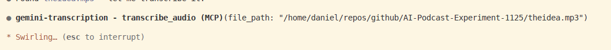

# Gemini Transcription MCP

An MCP server that provides audio-to-text transcription using Google's Gemini multimodal API.


## Overview

This MCP server provides tools for transcribing audio files using Gemini's multimodal capabilities. Unlike conventional speech-to-text services, Gemini can process both audio and a steering prompt simultaneously, enabling transcription with intelligent post-processing in a single API call.

## Why This MCP?

- **Multimodal Advantage**: Gemini processes audio and text instructions together, allowing combined transcription and language processing in one operation
- **Minimal Context Overhead**: A dedicated transcription MCP avoids the context bloat that comes with large tool definitions
- **Built-in Post-Processing**: The transcription prompt is pre-configured, so users simply provide an audio file path and receive a cleaned, structured transcript
- **Auto-Save Option**: Optionally save transcripts directly to your working directory with descriptive filenames

## Tools

This MCP provides two tools:

### `transcribe_audio` (Recommended)

Transcribes audio with intelligent cleanup:
- Removes filler words ("um," "uh," "like")
- Applies verbal corrections (e.g., "I meant..." becomes the corrected text)
- Adds punctuation and paragraph breaks
- Generates section headings where appropriate

### `transcribe_audio_raw`

Transcribes audio verbatim:
- Includes all filler words and false starts
- No cleanup or restructuring
- Useful when you need exact speech-to-text

Both tools accept:
- `file_path` (required): Absolute path to the audio file
- `output_dir` (optional): Directory to save the transcript as a markdown file

## The Transcription Prompt

The key to this MCP's usefulness is the system prompt sent to Gemini. The edited transcription uses a prompt that instructs Gemini to:

1. **Omit filler words** - Remove "um," "uh," "like," etc.
2. **Honor inline corrections** - If you say "I need to buy kiwis—wait, I meant bananas," the output will be "I need to buy bananas"
3. **Add punctuation** - Ensure logical sentence structure
4. **Add paragraph breaks** - Improve readability
5. **Generate subheadings** - Divide text into logical sections

The prompt explicitly tells Gemini NOT to:
- Make stylistic improvements or reword for "better" prose
- Add information not present in the original audio
- Change the user's intended meaning

This results in a transcript that's easy to read while faithfully preserving your original content.

## Features

- Accepts audio file paths (MP3, WAV, OGG, FLAC, AAC, AIFF)
- Automatic audio downsampling to optimize for Gemini's 16 Kbps processing resolution
- Returns structured JSON with title, description, transcript, and timestamps
- Optional auto-save to markdown files with descriptive filenames

## Usage



Provide an audio file path, and the MCP returns a JSON response with:

| Field | Description |
|-------|-------------|
| `title` | Short descriptive title for the note |
| `description` | Two-sentence summary |
| `transcript` | Transcript in Markdown format |
| `timestamp` | ISO 8601 timestamp |
| `timestamp_readable` | Human-readable timestamp |
| `saved_to` | File path (only if `output_dir` was provided) |

### Example: Basic transcription

```
Transcribe /path/to/audio.mp3
```

### Example: Transcribe and save to current directory

```
Transcribe /path/to/audio.mp3 and save to the current directory
```

The MCP will save a markdown file with a slugified title (e.g., `meeting-notes-project-review.md`).

## Requirements

- Google Gemini API key ([get one here](https://aistudio.google.com/app/apikey))
- Node.js 18+
- ffmpeg (for processing large audio files)

## Installation

Install from npm:

```bash
npm install -g gemini-transcription-mcp
```

## Configuration

Add to your Claude Code MCP configuration (`~/.claude/settings.json`):

```json
{
  "mcpServers": {
    "gemini-transcription": {
      "command": "npx",
      "args": ["-y", "gemini-transcription-mcp"],
      "env": {
        "GEMINI_API_KEY": "your-api-key"
      }
    }
  }
}
```

Replace `your-api-key` with your [Gemini API key](https://aistudio.google.com/app/apikey).

### Alternative: Claude Code CLI

Add directly via command line:

```bash
claude mcp add gemini-transcription --scope user -e GEMINI_API_KEY=your-api-key -- npx -y gemini-transcription-mcp
```

### Alternative: Run from global install

If you installed globally with `npm install -g`:

```json
{
  "mcpServers": {
    "gemini-transcription": {
      "command": "gemini-transcription-mcp",
      "env": {
        "GEMINI_API_KEY": "your-api-key"
      }
    }
  }
}
```

## Disclaimer

This MCP server was developed using Claude Code (AI-assisted development). The human author provides direction, requirements, and testing, while the code generation is performed by the AI. Use at your own discretion and review the code before deploying in production environments.
