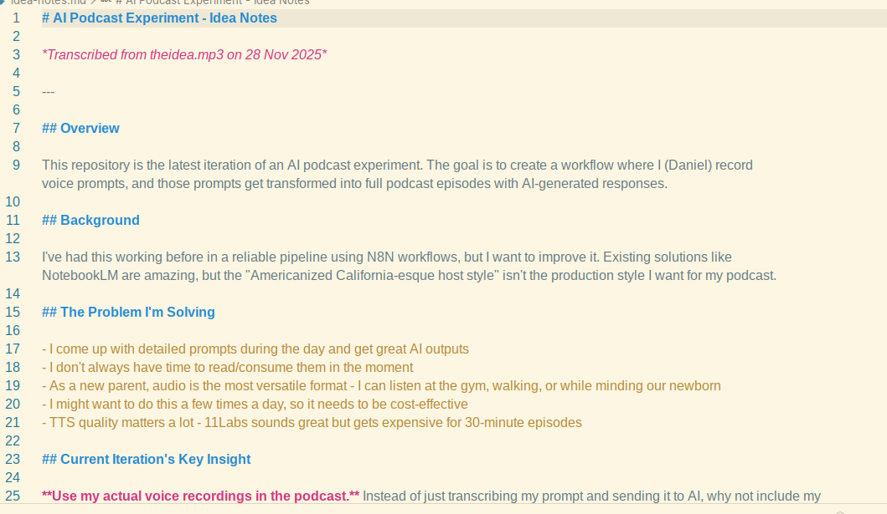

# Gemini Transcription MCP

An MCP (Model Context Protocol) server that provides audio-to-text transcription using Google's Gemini multimodal API.

[](https://www.npmjs.com/package/gemini-transcription-mcp)



## Overview

This MCP server enables AI assistants (like Claude) to transcribe audio files using Gemini's multimodal capabilities. Unlike conventional speech-to-text services, Gemini can process both audio and a steering prompt simultaneously, enabling transcription with intelligent post-processing in a single API call.

## Why This Server?

- **Multimodal Advantage**: Gemini processes audio and text instructions together, allowing combined transcription and language processing in one operation
- **Built-in Post-Processing**: The transcription prompt is pre-configured, so users simply upload an audio file and receive a cleaned, structured transcript.
- **Four Transcription Modes**:
    - **Edited**: Transcribes audio with intelligent cleanup (removes filler words, applies verbal corrections, adds punctuation).
    - **Raw**: Transcribes audio verbatim, including all filler words and false starts.
    - **Custom**: User provides their own transcription prompt for full control.
    - **Format**: Transcribe and format as a specific document type (email, to-do list, meeting notes, etc.).

## The Transcription Prompt

The key to this server's usefulness is the system prompt sent to Gemini. The edited transcription uses a prompt that instructs Gemini to:

1. **Omit filler words** - Remove "um," "uh," "like," etc.
2. **Honor inline corrections** - If you say "I need to buy kiwis—wait, I meant bananas," the output will be "I need to buy bananas"
3. **Add punctuation** - Ensure logical sentence structure
4. **Add paragraph breaks** - Improve readability
5. **Generate subheadings** - Divide text into logical sections

The prompt explicitly tells Gemini NOT to:
- Make stylistic improvements or reword for "better" prose
- Add information not present in the original audio
- Change the user's intended meaning

This results in a transcript that's easy to read while faithfully preserving your original content.

## Features

- Supports audio formats: MP3, WAV, OGG, FLAC, AAC, AIFF, M4A
- Automatic audio downsampling to optimize for Gemini's 16 Kbps processing resolution
- Returns structured JSON with title, description, transcript, and timestamps
- Multiple input methods: base64, URL, or SSH/SCP pull

## Requirements

- Google Gemini API key ([get one here](https://aistudio.google.com/app/apikey))
- Node.js 18+
- ffmpeg (for processing large audio files)

## Installation

### From npm (recommended)

```bash
npm install -g gemini-transcription-mcp
```

Or run directly with npx:

```bash
npx gemini-transcription-mcp
```

### From source

1.  Clone the repository:
    ```bash
    git clone https://github.com/danielrosehill/Gemini-Transcription-MCP.git
    cd Gemini-Transcription-MCP
    ```
2.  Install dependencies:
    ```bash
    npm install
    ```
3.  Build the project:
    ```bash
    npm run build
    ```

## Configuration

### API Key

Set the `GEMINI_API_KEY` environment variable to your Google Gemini API key. You can do this by creating a `.env` file in the root of the project:

```
GEMINI_API_KEY=your-api-key
```

Or by setting it in your shell:

```bash
export GEMINI_API_KEY=your-api-key
```

### Model Selection

By default, this MCP uses `gemini-flash-latest` (Gemini Flash Latest). You can select a different model using the `GEMINI_MODEL` environment variable:

| Shorthand | Model | Description |
|-----------|-------|-------------|
| `1` (default) | `gemini-flash-latest` | Gemini Flash Latest - dynamic endpoint |
| `2` | `gemini-2.5-flash-preview-05-20` | Gemini 2.5 Flash Preview |
| `3` | `gemini-2.5-flash-lite-preview-06-17` | Gemini 2.5 Flash Lite (economic) |
| `4` | `gemini-3-flash-preview` | Gemini 3 Flash Preview (newest) |

```bash
# Use shorthand
export GEMINI_MODEL=2

# Or use full model name
export GEMINI_MODEL=gemini-2.5-flash-preview-05-20
```

See [models.md](models.md) for detailed model information and selection guidance.

## Usage

### Claude Code CLI

Add the MCP server using the Claude Code CLI:

```bash
claude mcp add gemini-transcription -e GEMINI_API_KEY=your-api-key -- npx -y gemini-transcription-mcp
```

To add it globally (user-level):

```bash
claude mcp add gemini-transcription -s user -e GEMINI_API_KEY=your-api-key -- npx -y gemini-transcription-mcp
```

### Claude Desktop Configuration

Add to your MCP configuration file:

```json
{
  "mcpServers": {
    "gemini-transcription": {
      "command": "npx",
      "args": ["-y", "gemini-transcription-mcp"],
      "env": {
        "GEMINI_API_KEY": "your-api-key"
      }
    }
  }
}
```

Or if installed globally:

```json
{
  "mcpServers": {
    "gemini-transcription": {
      "command": "gemini-transcription-mcp",
      "env": {
        "GEMINI_API_KEY": "your-api-key"
      }
    }
  }
}
```

### MCP Tools

Use the MCP tools by sending either a base64 payload **or** a downloadable URL.

| Tool | Description |
|------|-------------|
| `transcribe_audio` | Lightly edited transcript (removes filler words, applies corrections) |
| `transcribe_audio_raw` | Verbatim transcript with no cleanup |
| `transcribe_audio_custom` | User provides a custom prompt for full control |
| `transcribe_audio_format` | Transcribes and formats as a specified document type |

**Common Parameters** (all tools):

- `file_content` (optional): Base64-encoded audio content.
- `file_url` (optional): HTTP(S) URL to fetch the audio from (use this in the "true proxy"/remote setup).
- `ssh_host` + `ssh_path` (optional): Pull the audio directly over SSH/SCP when the MCP host has key-based SSH access to the client (e.g., `ssh_host: "client.local"` and `ssh_path: "/tmp/audio.wav"`). Optional `ssh_user` and `ssh_port` are supported.
- `file_name` (optional): Helpful when using `file_url` without a filename.
- `output_dir` (optional): Where to save a markdown copy of the transcript.

At least one of `file_content`, `file_url`, or `ssh_host`+`ssh_path` must be provided.

**Tool-Specific Parameters**:

| Tool | Parameter | Description |
|------|-----------|-------------|
| `transcribe_audio_custom` | `custom_prompt` (required) | Your custom transcription instructions for Gemini |
| `transcribe_audio_format` | `format` (required) | The desired output format (e.g., "email", "to-do list", "meeting notes") |

**SSH pull example (no manual upload):**

```json
{
  "name": "transcribe_audio",
  "arguments": {
    "ssh_host": "client.example.com",
    "ssh_path": "/tmp/audio.wav",
    "ssh_user": "myuser",        // optional
    "ssh_port": 2222             // optional
  }
}
```

This uses `scp` from the MCP host to the client. Ensure key-based SSH works from the MCP host to the client and `scp` is available on the MCP host. The file is streamed to a temp directory, size-checked, downsampled if large, then uploaded to Gemini.

**Format transcription example (to-do list):**

```json
{
  "name": "transcribe_audio_format",
  "arguments": {
    "file_url": "https://example.com/voice-note.mp3",
    "format": "to-do list"
  }
}
```

The tool intelligently formats the transcribed content. Supported formats include: email, to-do list, meeting notes, technical document, blog post, executive summary, letter, report, outline, and any other format you describe.

**Custom prompt example:**

```json
{
  "name": "transcribe_audio_custom",
  "arguments": {
    "file_url": "https://example.com/interview.mp3",
    "custom_prompt": "Transcribe this interview. Format as a Q&A dialogue with speaker labels. Return JSON with 'transcript' field."
  }
}
```

### Response Format

All tools return a JSON object with:

| Field | Description |
|-------|-------------|
| `title` | Short descriptive title for the note |
| `description` | Two-sentence summary |
| `transcript` | Transcript in Markdown format |
| `timestamp` | ISO 8601 timestamp |
| `timestamp_readable` | Human-readable timestamp |

## License

MIT

## Disclaimer

This server was developed using Claude Code (AI-assisted development). The human author provides direction, requirements, and testing, while the code generation is performed by the AI. Use at your own discretion and review the code before deploying in production environments.
